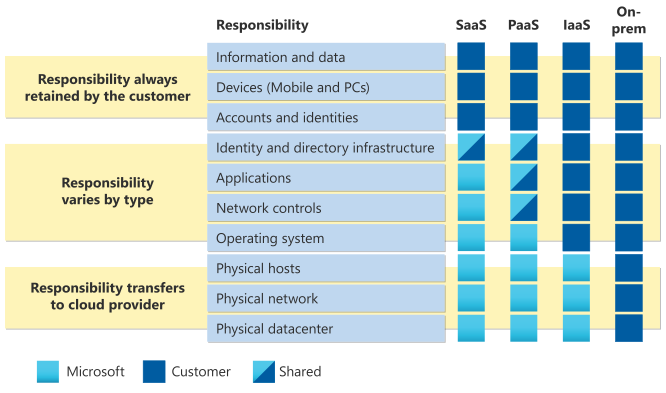

Part 3

-> **PT-BR**

### Tipos de serviços de nuvem na azure

- IaaS
- Paas
- Saas

- **Iaas (infraestrutura como serviço)**
    - O usuário tem uma atuação maior nas configurações do recurso criado.
    - Maior acesso no contexto de personalização do recurso.

- **Paas (plataforma como serviço)**
    - Engloba o Iaas
        - Servidores e armazemaneto
        - Firewalls/ segurança de rede
    - Além de:  
        - Sistema operacionais
        - Ferramentas para desenvolvedores
        - Análise de negócios de gerenciamento de database (banco de dados)

    - Fornece um ambiente para a criação, teste e a implementação de aplicativos de software, sem focar gerenciamento da infraestrutura subjacente.

- **SaaS (software como serviço)**
    - Exemplo de plataformas Saas (Teams e Office 365)
    - Conforme o modelo de licença, temos opções de visualização e uso diferentes.
    - Os usuários se conectam e usam aplicativos com base em nuvem como serviço.
    - Menos responsabilidade de manutenção.

### Modelo de responsabilidade compartilhada

 ***Fonte: Microsoft***

- **Categorias que são responsabilidade do servidor (Microsoft)**
    - Hosts Físicos
    - Rede física
    - Datacenter Físico
    - O cliente não tem ação nesse cenário

- **Responsabilidades que podem ser dividas com o servidor**
    ***A responsabilidade varia conforme o tipo***
        - Infraestrutura de identidade e diretório
        - Aplicativos
        - Controles de rede
        - Sistema operacional (exceto para Iaas)

    ***Iaas***
        - Toda a responsabilidade permanece por parte do clinte
    
    ***Paas***
        - A responsabilidade é dividade entre o cliente e a Microsoft
    
    ***Saas***
        - A infraestrutura de identidade e diretório é único ponto onde ocorre a divisão de responsabilidade entre cliente e Microsoft (Cloud provider).

- **Responsabilidade é sempre retida pelo cliente**
    - Informações e dados
    - Dispositivos (módeis e PCs)
    - Contas e identidade e diretório
    - A responsabilidade para manutenção e monitoramente é total do cliente.

- **Comparação dos tipos de serviço na nuvem**

    ***Iaas***
        - Serviço de nuvem mais flexível
        - O cliente configura e administra o hardware utilizado pelo recurso.

    ***Paas***
        - Focado no desenvolvimento de aplicativos
        - Manutenção e gerencia do aplicativo/plataforma é feito pela Microsoft.

    ***Saas***
        - Modelo de preço de pagamento conforme o uso.
        - Menor controle e acesso.
        - Usuários pagam pelo software que utilizam através do modelo de assinatura.

-----------------------------------------------------------------------------------------------
